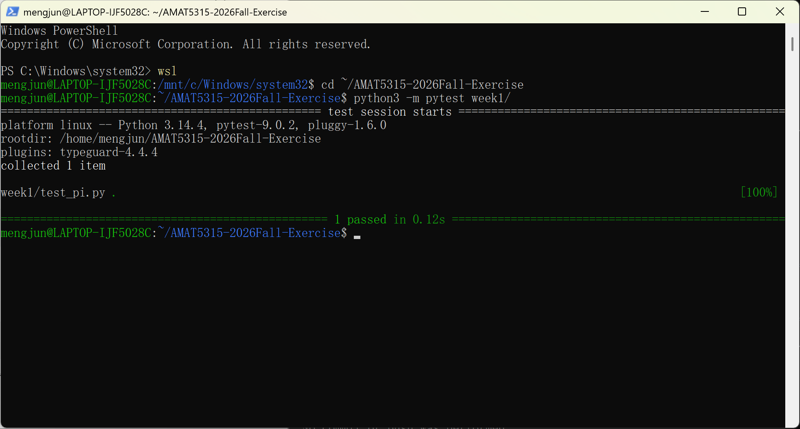

# AMAT5315 Fall 2026 Exercises

This repository contains weekly exercises and learning work for AMAT5315 in Fall 2026. Each week's work is organized in its own directory, such as `week1/`, `week2/`, and so on.

## Install pytest

On Ubuntu, install pytest with:

```bash
sudo apt install python3-pytest
```

## Run the Week 1 tests

From the repository root, run:

```bash
python3 -m pytest week1/
```

## Test results

The screenshot below shows the pytest suite completing successfully.


