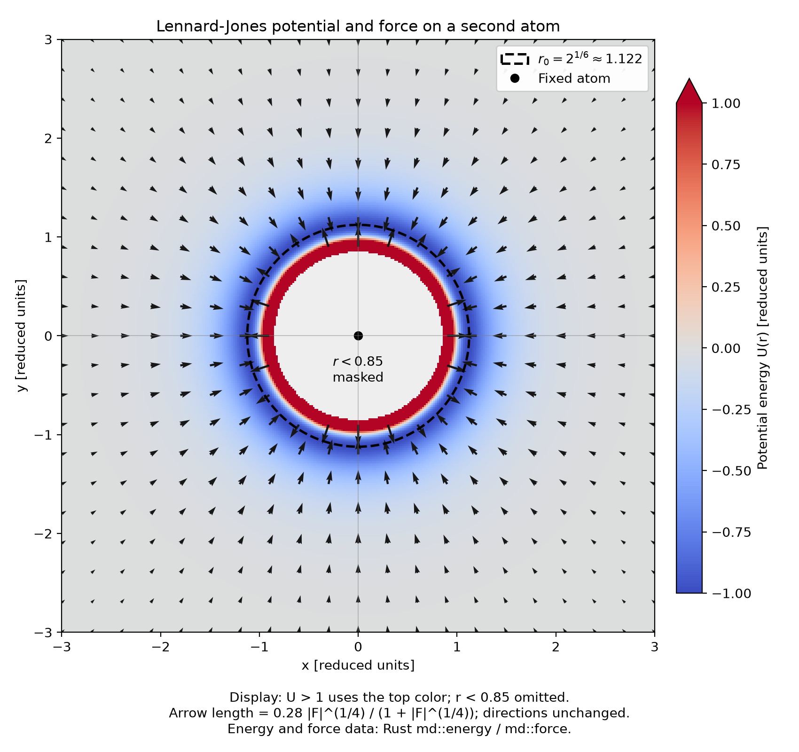
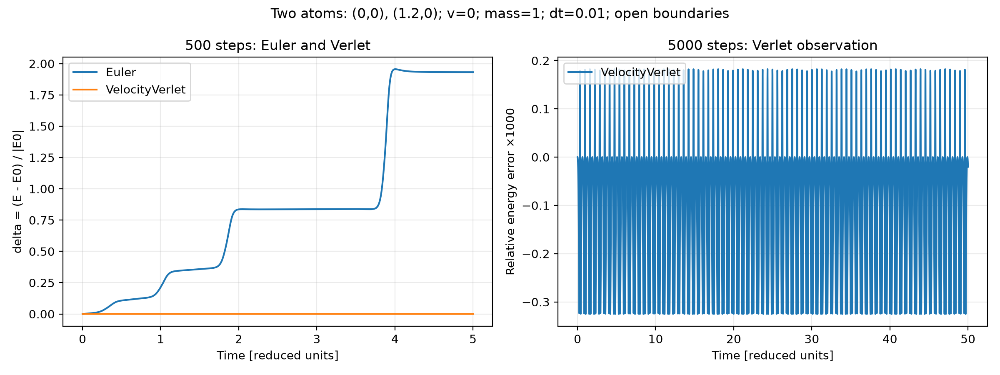
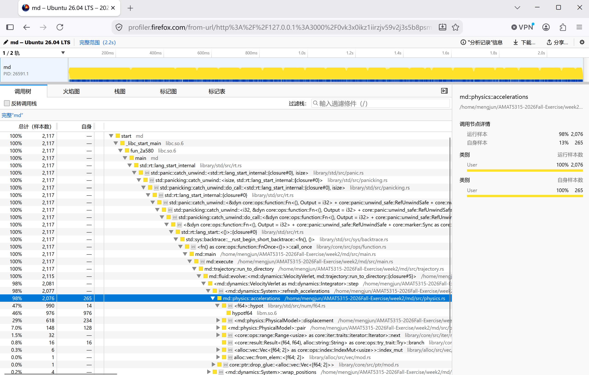
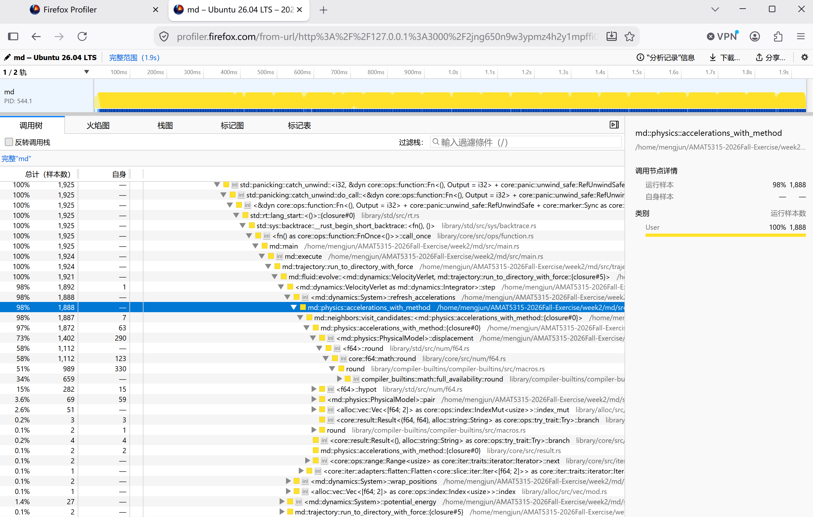
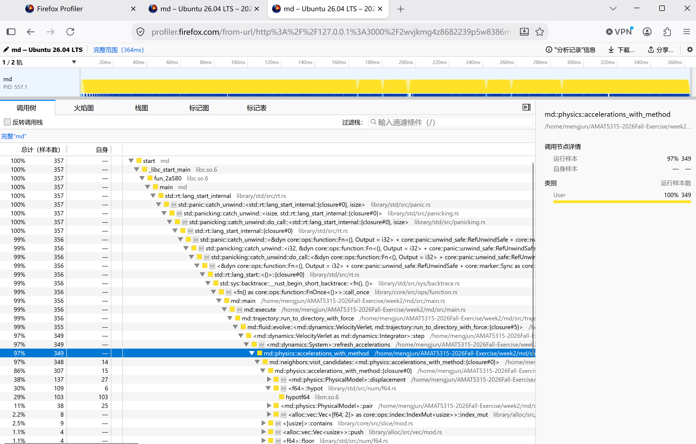

# Week 2: 力场可视化

固定一个原子在二维原点，背景显示另一个原子的势能，箭头显示它受到的力。
采用约化单位（Lennard-Jones 参数 sigma = epsilon = 1）。

现有 `md/src/lib.rs` 中的函数为：

```rust
pub fn energy(r: f64) -> f64 {
    4.0 * (r.powi(-12) - r.powi(-6))
}

/// Returns the radial force: positive is repulsive, negative is attractive.
pub fn force(r: f64) -> f64 {
    24.0 / r * (2.0 * r.powi(-12) - r.powi(-6))
}
```

`force` 直接计算解析式 `-dU/dr`，没有使用数值差分。
已有测试中的中心差分仅用于验证解析力。

`md/examples/field.rs` 在 `[-3, 3] × [-3, 3]` 的 321 × 321 网格上调用
`md::energy(r)` 和 `md::force(r)`，并导出
`Fx = force(r) * x/r`、`Fy = force(r) * y/r`。
`plot_field.py` 自动执行此 Rust example，通过内存中的 CSV 读取结果，
不在 Python 中重新计算势能或力的公式，也不保存临时数据文件。

显示处理：

- Rust 在调用函数前跳过 `r < 0.85`，包括 `r = 0`；图中该区域为灰色。
- 势能色标范围为 `[-1, 1]`，所有 `U > 1` 使用最高颜色；原始数据不截断。
- 箭头每隔 16 个网格点采样。显示长度为
  `L = 0.28 |F|^(1/4) / (1 + |F|^(1/4))`，让远处较弱的力也清晰可见。
  两个分量同时乘以正数 `L / |F|`，方向不变；零力保持为零。
- 虚线圆标出 `r0 = 2^(1/6)`：圆内排斥、圆外吸引，圆上力为零。
  x、y 坐标保持等比例。

## 从 week2/ 重新生成

依赖：支持 Rust 2024 edition 的 Rust/Cargo（Rust 1.85 或更高版本），
Python 3、NumPy、Matplotlib。运行全部测试还需要 pytest。
Python 需要可用的 `venv` 和 `pip`（Ubuntu 可安装 `python3-venv`、`python3-pip`）。

在 `week2/` 目录执行以下命令，依赖安装到 `/tmp` 下的独立环境：

```bash
python3 -m venv /tmp/amat5315-field-venv
/tmp/amat5315-field-venv/bin/python -m pip install numpy matplotlib pytest
/tmp/amat5315-field-venv/bin/python plot_field.py
```

如果系统有 pip，但缺少 ensurepip，可用以下等价方式建立环境和安装依赖：

```bash
python3 -m venv --without-pip /tmp/amat5315-field-venv
python3 -m pip --python /tmp/amat5315-field-venv/bin/python install numpy matplotlib pytest
/tmp/amat5315-field-venv/bin/python plot_field.py
```

图片保存为本目录的 `field.png`。使用无界面的 Agg 后端，不需要图形桌面。
Rust 构建文件位于已被 Git 忽略的 `md/target/`。

## 运行全部测试

同样从 `week2/` 执行：

```bash
cargo test --manifest-path md/Cargo.toml --all-targets
cargo test --manifest-path md/Cargo.toml --doc
/tmp/amat5315-field-venv/bin/python -m pytest ../week1/
```



## Part 3：两原子积分与能量误差

初始位置 `(0,0)`、`(1.2,0)`，速度均为零，质量均为 1。
开放边界，使用现有原始 Lennard-Jones 解析势与力，无截断、无温控。
`dt=0.01`，Euler 和 VelocityVerlet 各运行 500 步；Verlet 另从同一初态运行到 5000 步。

`System` 持有私有 `Vec<[f64; 2]>` 位置、速度及加速度缓存；构造检查长度一致。
积分器采用 `step(&self, system: &mut System, dt: f64)`，由同一个泛型 `simulate` 驱动。
Euler 使用旧状态更新；Verlet 按半步速度、位置、刷新加速度、半步速度的顺序更新。
每条非初态记录都在完整时间步之后产生。

Rust example `md/examples/two_atoms.rs` 计算 `E0=energy(1.2)`，并导出
`delta=(E-E0)/abs(E0)`；Python 只读取内存中的 CSV 并绘图。
左图显示两算法的 500 步 delta，右图实际显示 Verlet 5000 步的 `1000*delta`，
纵轴注明相对能量误差 ×1000；报告中的误差值均为未乘 1000 的原始 delta。

从 `week2/` 运行全部测试：

```bash
cargo test --manifest-path md/Cargo.toml --all-targets
cargo test --manifest-path md/Cargo.toml --doc
/tmp/amat5315-field-venv/bin/python -m pytest ../week1/
```

重新生成本目录的 `dimer.png`：

```bash
MPLCONFIGDIR=/tmp/amat5315-matplotlib /tmp/amat5315-field-venv/bin/python plot_two_atoms.py
```

依赖与 Part 2 相同：Rust/Cargo、Python 3、NumPy、Matplotlib，旧 Python 测试需要 pytest。
若 `/tmp` 环境已被清理，按上文依赖安装命令重建后再运行。
脚本使用 Agg 后端，不需要图形桌面；不会保存 CSV 或把构建文件加入 Git。

实测结果（固定学习单参数）：

| 指标 | 结果 | 要求 |
| --- | --- | --- |
| Verlet 500 步 max(abs(delta)) | 0.00032504759 | < 0.001，通过 |
| Euler 500 步最终 delta | 1.9317763 | > 0.5，通过 |
| Verlet 5000 步 max(abs(delta)) | 0.0003250492 | 长期观察，不加阈值 |

在 `t=0..50` 内，Verlet 误差呈重复振荡，幅度与前 500 步接近，未见明显持续漂移。
这只是规定观察窗口内的结果。完整 red/green 证据见 [验证记录](part3-validation.md)。



## Part 4：周期 LJ 流体、轨迹检查与视频

`System` 使用显式模型枚举，共用 Euler/velocity-Verlet。旧 `System::new`、
两原子实验与原始 `energy`/`force` 保持开放边界和无截断；新流体入口使用周期边界、
rc=2.5 的势能平移截断，力不做平移，按 i<j 成对计算。
默认 N=100、rho=0.8、T=0.5、dt=0.01、平衡2000步、正式10000步、
每50步保存、seed=2026、velocity-verlet。默认生成200帧，不包含正式第0步。
初始去质心速度并缩放，平衡每50步缩放；正式阶段关闭温控。

`--n` 接受平方数且平方根为偶数（100、400、1600均支持），盒长按密度计算，
还须满足两边长度均大于2*rc。非法参数明确报错。本次只执行100原子实验。
随机数固定 ChaCha8Rng、StandardNormal，Cargo.lock固定依赖；同一构建环境可复现。
跨工具链/浮点平台不承诺逐位相同。

### 模拟与检查（不需要 Python 或 ffmpeg）

需要Rust/Cargo（本次实测rustc 1.98.1；依赖以Cargo.lock为准），`make reproduce`
还需要GNU Make。首次构建需要下载Cargo依赖。以下命令均从 `week2/` 执行：

```bash
make reproduce
./md/target/release/md check artifacts
```

Makefile 的 recipe 使用真实Tab；只执行release默认模拟，生成
`artifacts/run.json` 和 `artifacts/traj.jsonl`，不自动检查或生成视频。
设置了 `CARGO_TARGET_DIR` 时，请相应调整后续二进制路径。
直接调用CLI的准确形式为：

```bash
./md/target/release/md run --out artifacts
./md/target/release/md check artifacts
./md/target/release/md video artifacts --out fluid.mp4
```

run支持 `--n --rho --temperature --dt --eq-steps --steps --sample-every --seed
--integrator --force --ramp-to --out`；积分器名称为 `velocity-verlet` 或 `euler`，`--force`
可选 `naive` 或 `cells`，默认是 `cells`。可选 `--ramp-to` 会在正式阶段启用线性目标温度。
check输入目录为位置参数；任何文件错误、保存能量不一致或物理验收失败均非零退出。
它从每帧位置与速度重算能量，不推进模拟、不相信保存的能量。
交叉核对容差为 `1e-10*max(1,abs(recomputed))`。

默认教学验收：以第一保存帧重算总能量为E0，首尾各
`k=max(1,floor(frame_count/10))` 帧的平均能量差除以abs(E0)小于2e-3；
所有速率的 `T_speed=mean(v²)/2` 与0.5差值小于0.05；
二维Maxwell-Boltzmann分布的24个等概率箱，`sum((Ob-Eb)²/Eb)/22<2`。
最后一项仅是教学容差，不报告正式显著性或p值。无 ramp 时 check 的温度目标固定0.5，
不会随元数据temperature改变；video仅要求轨迹结构合法，不要求这些默认指标通过。

### Part 5 `--ramp-to` 加热

`md run --ramp-to T_end` 保持平衡阶段的固定起始温度 `--temperature`，并在正式阶段按
`T_target(s)=T_start+(T_end-T_start)*s/steps` 定义目标温度。每一步严格先完成完整积分，
再在正式步号为50的倍数时按 `T_thermo=2K/(2N-2)` 缩放，最后采样；因此同一步缩放和
采样时保存的是缩放后的速度和动能，末步不是50的倍数时不额外缩放。`ramp_to` 等于起始
温度仍表示启用正式阶段温控，省略参数则正式阶段完全关闭温控。

`run.json` 写入 `ramp_to`（数字或 `null`）；旧文件缺少该字段时按未启用 ramp 读取。
对加热轨迹，`md check` 仍从位置和速度用 naive 路径重算并核对保存能量，完整性通过返回0，
同时将能量漂移、固定温度和平衡速率分布明确标为 `SKIP`，因为它们不适用于加热过程，
总结为“加热轨迹完整性检查通过”。完整性失败仍返回非零。课程 viewer 文件未修改，
浏览器手动加载需另行检查。

实现与测试证据见 [Part 5 ramp 验证记录](part5-ramp-validation.md)。

短程验证示例（不会运行完整加热实验）：

```bash
md run --ramp-to 1.0 --eq-steps 0 --steps 51 --sample-every 50 --out /tmp/md-ramp-short
md check /tmp/md-ramp-short
```

### 视频依赖与环境重建

视频需要Python 3、NumPy、Matplotlib、ffmpeg、ffprobe及libx264编码器。
`MD_PYTHON` 指定**实际Python解释器路径**；未设置时使用PATH中的python3。
以下步骤可以在 `/tmp` 环境被清理后重新建立，不依赖旧环境仍存在：

```bash
python3 -m venv /tmp/amat5315-field-venv
/tmp/amat5315-field-venv/bin/python -m pip install numpy==2.5.3 matplotlib==3.11.1 pytest==9.1.1
export MD_PYTHON=/tmp/amat5315-field-venv/bin/python
export MPLCONFIGDIR=/tmp/amat5315-matplotlib
```

若缺少ensurepip，可用系统pip重建：

```bash
python3 -m venv --without-pip /tmp/amat5315-field-venv
python3 -m pip --python /tmp/amat5315-field-venv/bin/python install numpy==2.5.3 matplotlib==3.11.1 pytest==9.1.1
export MD_PYTHON=/tmp/amat5315-field-venv/bin/python
export MPLCONFIGDIR=/tmp/amat5315-matplotlib
```

Ubuntu可通过 `sudo apt-get install ffmpeg` 安装编码依赖。
本次无交互sudo，使用Linux x86_64静态包；可按以下命令重建：

```bash
curl -L --fail https://johnvansickle.com/ffmpeg/releases/ffmpeg-release-amd64-static.tar.xz -o /tmp/amat5315-ffmpeg.tar.xz
mkdir -p /tmp/amat5315-ffmpeg
tar -xJf /tmp/amat5315-ffmpeg.tar.xz -C /tmp/amat5315-ffmpeg --strip-components=1
export PATH=/tmp/amat5315-ffmpeg:$PATH
ffmpeg -version
ffprobe -version
"$MD_PYTHON" -c 'import numpy, matplotlib'
./md/target/release/md video artifacts --out fluid.mp4
```

本次静态包版本7.0.2，含libx264。其他CPU/系统应使用适合本机的ffmpeg安装包。
`md video` 自行预检这些依赖，缺失时报错；视频测试不忽略、不静默跳过。

右图采用**最近20个保存帧的滑动平均**，不足20帧时使用已有帧，标题标出实际窗口。
80个径向区间，minimum image距离最多为短盒边一半，不受力截断rc限制。
若窗口F帧的无序对累计数为C_b，rho=N/(Lx*Ly)，则
`g_b=2*C_b/[F*N*rho*pi*(r_outer²-r_inner²)]`。
有限N均匀体系期望为(N-1)/N，不再缩放尾部到1。
Rust计算RDF，Python仅绘制；20fps，每保存帧一视频帧，默认200帧、10秒。
编码后实际检查帧数与小于2,000,000字节的限制。

最终 [fluid.mp4](fluid.mp4) 纳入Git；`artifacts/` 轨迹、`target/` 构建缓存及临时视频
不纳入Git，没有全局mp4忽略规则，后续cold.mp4、hot.mp4也可以提交。
课程viewer请加载 `week2/artifacts/run.json` 与 `week2/artifacts/traj.jsonl`；
**Part 4 已由仓库 owner 亲自核对通过，包括 check、视频和课程 viewer。**

### 全部回归（包含真实视频测试）

完成上述视频环境设置后，从week2运行：

```bash
cargo test --release --manifest-path md/Cargo.toml --all-targets
cargo test --manifest-path md/Cargo.toml --doc
"$MD_PYTHON" -m pytest ../week1/
```

红绿提交、默认物理指标与视频实测结果见 [Part 4 验证记录](part4-validation.md)。

## Part 5：cell list 邻居搜索

周期流体现在把邻居搜索策略与成对 Lennard-Jones 物理计算分开。`--force naive`
保留全配对路径；`--force cells` 按当前位置重建周期 cell list，搜索自身及周围八个
格子，候选格子编号先去重，再以 `j > i` 保证每对只计算一次。两条路径共用
minimum-image、截断判断、势能平移和解析力公式。开放边界的旧两原子模型继续使用
naive 路径。

`run.json` 新增 `force_method`，记录实际策略为 `"naive"` 或 `"cells"`。读取缺少
该字段的旧文件时按 `naive` 处理；未知值或 `null` 会拒绝。`md check` 始终从位置和
速度用 naive 路径重算物理量，不依据元数据选择检查算法。新增的 cells 轨迹供课程
viewer 手动加载，独立保存于 `week2/artifacts/cells-viewer/run.json` 和
`week2/artifacts/cells-viewer/traj.jsonl`，不会覆盖 Part 4 轨迹；新增字段与 viewer
源码的 JSON 读取方式兼容，浏览器手动加载仍待课程 owner 检查。

本轮 profiling 使用固定负载 `--n 400 --eq-steps 200 --steps 1000`；规模测速使用
N=100、400、1600、`--eq-steps 100 --steps 500`，两组实验不混用。

## Part 5：优化前测速与 profiling 准备

本阶段记录 naive 与 cell list 的测量结果，不加热、不发布网页。Timing表记录仓库owner
在第二个Ubuntu终端亲自完成的实测；Profile结果来自用户查看的真实采样。

### Timing

| Program | Median (s) | Range: min–max (s) |
| --- | --- | --- |
| NumPy | 10.279 | 10.204–10.405 |
| Rust debug | 7.248 | 7.190–7.314 |
| Rust release | 1.327 | 1.315–1.330 |

每组3次，计时采用 **Bash shell `time` 的 `real`**，不包含构建时间。原始数据（秒）：

- NumPy：10.279、10.405、10.204；原脚本seed=42。
- Rust debug：7.190、7.248、7.314；默认seed=2026。
- Rust release：1.330、1.315、1.327；默认seed=2026。

按中位数计算，release相对debug加速约 **5.46倍**（7.248/1.327），
本次相对NumPy约 **7.75倍**（10.279/1.327）。尚未进行cell list优化。

### Profile

| Version | Force share (%) | Elapsed time (s) |
| --- | --- | --- |
| Naive | 98 | 约 2.2 |
| Naive (same build) | 98 | 约 1.9 |
| Cell list (same build) | 97 | 约 0.364 |

原始Naive采样负载为 `md run --n 400 --eq-steps 200 --steps 1000 --out /tmp/md-prof`，
用户已在浏览器查看完整记录区间，界面显示约2.2 s；
按显示精度记录，不由样本数推算更多时间小数。
`md::physics::accelerations` 的inclusive总计为98%，对应2076个样本，
主线程总样本2117。`hypotf64`的46%是内部子函数占比，不作为总力占比，也不与98%相加。
原始截图为 `profile-naive.png`。同一新版构建、相同负载的补充采样中，
`accelerations_with_method` 在 naive 中为98%（1888/1925样本），完整范围约1.9 s；
cells 中为97%（349/357样本），完整范围约0.364 s。两者约5.2倍加速是 profiling
观察值，不是重复 benchmark 结果。







### Benchmark

每个 N 和 force method 串行运行3次，使用同一个已安装 release 二进制；命令为
`--eq-steps 100 --steps 500`，总计600个积分步。计时是 shell `time` 的 wall-clock
real，不包含构建时间。表中耗时为中位数（min–max），主加速比为 naive 中位数除以
cells 中位数；若给出范围，它只是三次重复结果的范围，不是置信区间。

| N | naive (s) | cells (s) | speedup |
|---:|---:|---:|---:|
| 100 | 0.062 (0.061–0.063) | 0.045 (0.044–0.047) | 1.38× |
| 400 | 0.947 (0.946–0.950) | 0.174 (0.171–0.174) | 5.44× |
| 1600 | 14.822 (14.761–15.231) | 0.750 (0.749–0.753) | 19.76× |

原始18次记录（包含命令、退出状态和二进制哈希）见 [`scaling-results.csv`](scaling-results.csv)。
从 `week2/` 可用 `./benchmark_scaling.sh` 重跑并生成该文件，再用
`MPLCONFIGDIR=/tmp/amat5315-matplotlib python3 plot_scaling.py` 生成图；轨迹写入 `/tmp` 后立即删除。固定密度和截断下，
全配对搜索工作量约随 N² 增长，cell list 约随 N 增长。

`scaling.png` 的纵轴是总耗时除以600个积分步，包含初始化和输出开销；使用双对数坐标，
两条线分别标注 naive 与 cells。
加速比随 N 增长，N=1600 时为 19.76×，超过2；这只是本次三次重复的中位数比值。

### 已完成的环境准备

`md/Cargo.toml` 明确保留release优化和完整调试信息：

```toml
[profile.release]
opt-level = 3
debug = true
strip = false
```

已完成debug构建和release安装（从week2重建的等价命令）：

```bash
cargo build --locked --manifest-path md/Cargo.toml
cargo install --path md --profile release --locked --force --target-dir md/target --root "$HOME/.cargo"
export PATH="$HOME/.cargo/bin:$PATH"
hash -r
command -v md
md --help
cmp "$(command -v md)" md/target/release/md
readelf -S "$(command -v md)" | grep -E 'debug_info|debug_line|symtab'
```

准备时`command -v md`实际返回`/home/mengjun/.cargo/bin/md`。
Cargo安装记录指向本仓库`week2/md`；安装文件和`md/target/release/md`的SHA-256均为
`5c130709398935f37efc61e9267f8b8e284e6cb2086a9f708de7b719f234379a`。
构建输出为`release [optimized + debuginfo]`，ELF包含`.debug_info`、`.debug_line`和`.symtab`。
之后修改源码或构建配置须重新安装再测量，避免PATH上的旧版本参与比较。

课程NumPy基准[原始下载地址](https://giggleliu.github.io/AMAT5315-2026Fall/downloads/week2-sim.py)
已逐字节保存为`week2-sim.py`，没有修改计算内容。
下载文件SHA-256为`ec03acaf7e28fed74f4faa28a1b30e57924a0c6a1af4afd04a50f3f22ba9f7bc`。
原脚本固定SEED=42，在平衡循环s=0,50,...时缩放，保存时使用9位有效数字；
本项目Rust保持SEED=2026及已确认规则。因此这里比较两份现有程序的端到端运行时间，
不能声称是同一条初态轨迹或仅力核的微基准。两者默认均为100原子、2000平衡步和10000正式步。

复用`/tmp/amat5315-field-venv/bin/python`，NumPy 2.5.3可导入；
已通过runpy以非`__main__`方式加载课程脚本验证依赖，没有执行main或模拟。
若该临时环境已清理，按前文“视频依赖与环境重建”重新建立；只做测速时也可建立仅NumPy环境：

```bash
python3 -m venv /tmp/amat5315-field-venv
/tmp/amat5315-field-venv/bin/python -m pip install numpy==2.5.3
```

缺ensurepip时采用前文`--without-pip`与系统pip的重建方式。不要用系统无NumPy的Python替换命令而忽略错误。

### 第二个Ubuntu终端：亲自测速

以下整段从本仓库`week2/`执行。每项顺序运行3次，采用Bash shell `time` 的 `real`，报告中位数及最小/最大值。
计时包含进程启动、平衡、正式模拟和轨迹写入，不包含编译、check、video或samply。
各自输出放到`artifacts/part5-timing/`子目录，不覆盖已检查的`artifacts/run.json`和`traj.jsonl`。
此目录已被Git忽略。测量时不要同时运行其他模拟或profiler。

```bash
cd /home/mengjun/AMAT5315-2026Fall-Exercise/week2
export PATH="$HOME/.cargo/bin:$PATH"
export MD_PYTHON=/tmp/amat5315-field-venv/bin/python
hash -r
command -v md
cmp "$(command -v md)" md/target/release/md
"$MD_PYTHON" -c 'import numpy; print(numpy.__version__)'

WEEK2_DIR="$(pwd -P)"
measure_md_program() {
    local label="$1"
    shift
    (
        set -e
        mkdir -p "$WEEK2_DIR/artifacts/part5-timing/$label"
        cd "$WEEK2_DIR/artifacts/part5-timing/$label"
        : > times.txt
        TIMEFORMAT='%3R'
        export LC_ALL=C
        for repeat in 1 2 3; do
            { time "$@" > "run-$repeat.log" 2> "run-$repeat.err"; } 2>> times.txt
        done
    )
}
measure_md_program numpy "$MD_PYTHON" "$WEEK2_DIR/week2-sim.py" &&
measure_md_program rust-debug "$WEEK2_DIR/md/target/debug/md" run --out artifacts &&
measure_md_program rust-release md run --out artifacts &&
"$MD_PYTHON" - <<'PY'
from pathlib import Path
from statistics import median
root = Path('artifacts/part5-timing')
for folder, label in [('numpy', 'NumPy'), ('rust-debug', 'Rust debug'), ('rust-release', 'Rust release')]:
    values = [float(s) for s in (root / folder / 'times.txt').read_text().splitlines()]
    if len(values) != 3:
        raise RuntimeError(f'{label}: expected three successful measurements')
    print(f'{label}: median={median(values):.3f} s; range={min(values):.3f}–{max(values):.3f} s')
PY
```

上述命令使用Bash内建`time`，`TIMEFORMAT='%3R'`输出三位小数的real秒数。任何一次失败应先检查相应日志，
不要把不完整测量或失败退出的耗时填入表中。本表来自用户提供的3次实测，本次编辑没有重新测速。

### samply命令与当前WSL限制

已安装[samply官方版本0.13.1](https://github.com/mstange/samply)，路径
`/home/mengjun/.cargo/bin/samply`；`samply --version`与子命令help已检查。
重建可使用官方预编译安装器（不修改shell配置，PATH由上述export管理）：

```bash
curl --proto '=https' --tlsv1.2 -LsSf https://github.com/mstange/samply/releases/download/samply-v0.13.1/samply-installer.sh -o /tmp/amat5315-samply-installer.sh
SAMPLY_NO_MODIFY_PATH=1 sh /tmp/amat5315-samply-installer.sh
samply --version
```

准备阶段仅对`/bin/sleep 0.05`做环境探测，没有profile分子模拟。
在沙箱内、沙箱外均退出1，实际错误为：

```text
'/proc/sys/kernel/perf_event_paranoid' is currently set to 2.
In order for samply to work with a non-root user, this level needs
to be set to 1 or lower.
You can execute the following command and then try again:
    echo '1' | sudo tee /proc/sys/kernel/perf_event_paranoid
```

本次只读复查：发行版Ubuntu，WSL2内核`6.18.33.2-microsoft-standard-WSL2`，
`perf_event_paranoid=2`、`kptr_restrict=1`；安装的md仍与本项目release二进制一致，调试符号存在。
目前确认的是perf事件权限阻塞，不能据此断言WSL内核不支持采样。
针对samply 0.13.1已报告的限制，先把`perf_event_paranoid`临时从2调到1；
保持`kptr_restrict`不变，不添加capability，不写`/etc/sysctl.conf`或`/etc/sysctl.d/`。
此设置会改变当前系统运行时权限，采样结束立即恢复。
参见[samply的Linux权限说明](https://github.com/mstange/samply#description)。

以下命令由用户在第二个Ubuntu终端从week2执行；sudo由用户亲自输入，没有由助手执行。

```bash
cd /home/mengjun/AMAT5315-2026Fall-Exercise/week2
export PATH="$HOME/.cargo/bin:$PATH"
hash -r
command -v md
cmp "$(command -v md)" md/target/release/md
MD_PERF_PARANOID_BEFORE="$(cat /proc/sys/kernel/perf_event_paranoid)"
printf 'Original perf_event_paranoid=%s\n' "$MD_PERF_PARANOID_BEFORE"
sudo sysctl -w kernel.perf_event_paranoid=1
cat /proc/sys/kernel/perf_event_paranoid
```

确认输出1后，使用学习单指定负载，不使用前面100原子的Timing负载：

```bash
mkdir -p artifacts/part5-profile
if samply record --save-only -o artifacts/part5-profile/naive.json.gz -- md run --n 400 --eq-steps 200 --steps 1000 --out /tmp/md-prof > artifacts/part5-profile/naive.stdout.log 2> artifacts/part5-profile/naive.stderr.log; then
    printf 'Sampling succeeded\n'
else
    MD_PROFILE_STATUS=$?
    printf 'Sampling failed: exit %s\n' "$MD_PROFILE_STATUS"
    cat artifacts/part5-profile/naive.stderr.log
fi
```

剩余Rust默认参数保持不变，包括seed=2026、rho=0.8、temperature=0.5、dt=0.01、
sample_every=50及velocity-verlet。模拟输出为`/tmp/md-prof/`，profile/log在被Git忽略的
`artifacts/part5-profile/`。不要以sudo运行md或samply。

无论采样成功或失败，在同一终端恢复刚保存的原值；读取已有profile不需要放宽权限：

```bash
sudo sysctl -w "kernel.perf_event_paranoid=$MD_PERF_PARANOID_BEFORE"
cat /proc/sys/kernel/perf_event_paranoid
```

本次查到的原值是2。若终端关闭导致变量丢失，明确恢复命令为：

```bash
sudo sysctl -w kernel.perf_event_paranoid=2
```

若调整后仍失败，保留上述stderr和退出码再诊断，不能继续填写估计值，也不要自动进一步降低权限。
以上是此前权限受限时的操作记录；用户现已成功完成真实采样并在浏览器查看结果。

### 打开真实采样结果并保存profile-naive.png

仅在这一次采样成功后执行，避免把以前残留的profile当成本次结果：

```bash
samply load --no-open --address 127.0.0.1 artifacts/part5-profile/naive.json.gz
```

该命令保持运行；复制终端显示的完整profiler URL到Windows浏览器，按实际URL打开，
不要自行猜测端口或省略URL中的参数。本机回环服务用于查看符号，不点击发布/上传。

1. 选择`md`进程的主线程和完整记录区间；切到 **Call Tree**，展开调用层次，
   找到`md::physics::accelerations`及子调用。保留完整时间轴及未过滤的总计百分比。
   不要将搜索后缩小的分母误当成整个运行的Force share。
2. 截图中应能看见函数名、inclusive百分比和时间范围；如符号仍显示地址，先确认加载的是
   本次含调试信息的release二进制，不填写猜测值。
3. 在Windows按 **Win+Shift+S** 截取浏览器中的这些区域；点截图通知打开截图工具，
   **Ctrl+S**另存为PNG，文件名`profile-naive.png`，完整保存路径为：

   ```text
   \\wsl.localhost\Ubuntu\home\mengjun\AMAT5315-2026Fall-Exercise\week2\profile-naive.png
   ```

   也可在Ubuntu另一个终端用`wslpath -w "$PWD/profile-naive.png"`取得Windows路径
   （该终端须位于week2）。这是实际截图，不是把profile JSON改名为PNG。
   操作参见[Windows截图工具说明](https://support.microsoft.com/en-us/windows/apps/use-snipping-tool-to-capture-screenshots)。
4. 回到Ubuntu确认文件，再用Ctrl-C停止`samply load`：

   ```bash
   file profile-naive.png
   ```

用户已保存`profile-naive.png`，本次已确认图片存在并核对图中读数；Naive行已填写，Cell list行继续留空。

Force share记录所选md主线程完整运行区间中，`md::physics::accelerations`及其子调用的
inclusive样本占比；不要把父/子行百分比相加重复计数。Elapsed time记录profiler中同一
md进程完整区间的墙钟跨度，不用CPU样本时间或samply保存文件的总耗时代替。
保留安装的含符号二进制，避免重装别的版本后无法对应函数。Cell list行目前仅预留，尚未实现或测量。
